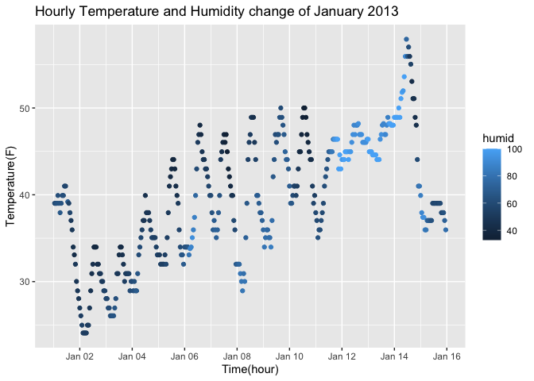

p8105_hw1_xw3106
================

\#Problem 1

``` r
library(moderndive)
data("early_january_weather")
```

The dataset “early_january_weather” is the hourly meteorological data
for EWR for the month of January in 2013. It have 358 observations and
15 variables. The dataset includes variables as listed: origin, year,
month, day, hour, temp, dewp, humid, wind_dir, wind_speed, wind_gust,
precip, pressure, visib, time_hour. Among them, “year, month, day, hour”
are time of the recording,“time_hour” records the date and hour as a
POSIXct date. “temp, dewp” are <dbl> that records temperature and
dewpoint in F;“wind_dir, wind_speed, wind_gus” records the wind
direction (in degrees), speed and gust speed (in mph). The mean
temperature is 39.5821229.

``` r
library(ggplot2)

plot1 <- ggplot(early_january_weather, aes(x = time_hour, y = temp, color = humid)) + geom_point() 
plot1 + labs(title = "Hourly Temperature and Humidity change of January 2013", x = "Time(hour)", y = "Temperature(F)") + scale_x_datetime(date_breaks = "2 day", date_labels = "%b %d")
```

<!-- -->

``` r
ggsave(ggsave("temperature_vs_humid_change.pdf", plot = plot1))
```

    ## Saving 7 x 5 in image
    ## Saving 7 x 5 in image

The scatter plot shows the temperature tends to increases during the
middle of day and drop at night, and it repeats with a daily cycle.
Lower humidity level are associated with temprature decrease from the
daily peak. From Jan12-Jan14, temprature remained relatively constant
with a high humidity level. After 12pm on Jan 14, humidity dropped
sharply followed by a noticeble temperature decrease.

\#Problem 2

``` r
library(tidyverse)
```

    ## ── Attaching core tidyverse packages ──────────────────────── tidyverse 2.0.0 ──
    ## ✔ dplyr     1.1.4     ✔ readr     2.1.5
    ## ✔ forcats   1.0.0     ✔ stringr   1.5.1
    ## ✔ lubridate 1.9.4     ✔ tibble    3.3.0
    ## ✔ purrr     1.0.4     ✔ tidyr     1.3.1
    ## ── Conflicts ────────────────────────────────────────── tidyverse_conflicts() ──
    ## ✖ dplyr::filter() masks stats::filter()
    ## ✖ dplyr::lag()    masks stats::lag()
    ## ℹ Use the conflicted package (<http://conflicted.r-lib.org/>) to force all conflicts to become errors

``` r
set.seed(1)

df = tibble(
  vec_numeric = rnorm(10),
  vec_logical = vec_numeric > 0,
  vec_char = letters[1:10],
  vec_factor = factor(c("A","B" ,"A", "B", "B", "C", "B","B" ,"C", "A"))
)
df
```

    ## # A tibble: 10 × 4
    ##    vec_numeric vec_logical vec_char vec_factor
    ##          <dbl> <lgl>       <chr>    <fct>     
    ##  1      -0.626 FALSE       a        A         
    ##  2       0.184 TRUE        b        B         
    ##  3      -0.836 FALSE       c        A         
    ##  4       1.60  TRUE        d        B         
    ##  5       0.330 TRUE        e        B         
    ##  6      -0.820 FALSE       f        C         
    ##  7       0.487 TRUE        g        B         
    ##  8       0.738 TRUE        h        B         
    ##  9       0.576 TRUE        i        C         
    ## 10      -0.305 FALSE       j        A

``` r
df |> pull(vec_numeric) |> mean()
```

    ## [1] 0.1322028

``` r
df |> pull(vec_logical) |> mean()
```

    ## [1] 0.6

``` r
df |> pull(vec_char) |> mean()
```

    ## Warning in mean.default(pull(df, vec_char)): argument is not numeric or
    ## logical: returning NA

    ## [1] NA

``` r
df |> pull(vec_factor) |> mean()
```

    ## Warning in mean.default(pull(df, vec_factor)): argument is not numeric or
    ## logical: returning NA

    ## [1] NA

The mean works for numeric and logical vectors. It does not work on char
and factor vectors.

``` r
df |> pull(vec_logical) |> as.numeric()
df |> pull(vec_char) |> as.numeric()
```

    ## Warning: NAs introduced by coercion

``` r
df |> pull(vec_factor) |> as.numeric()
```

Using `as.numeric()`, `vec_logical` returns the TRUE,FALSE into 0,1.
Therefore, it will be able to give an average based on the value of
TRUE.`vec_char` returns NA for all value since there is no way to
transform characters into numeric value. `vec_factor` turns into 1,2,3
for corresponding level, there is no meaning for the mean of the level.
